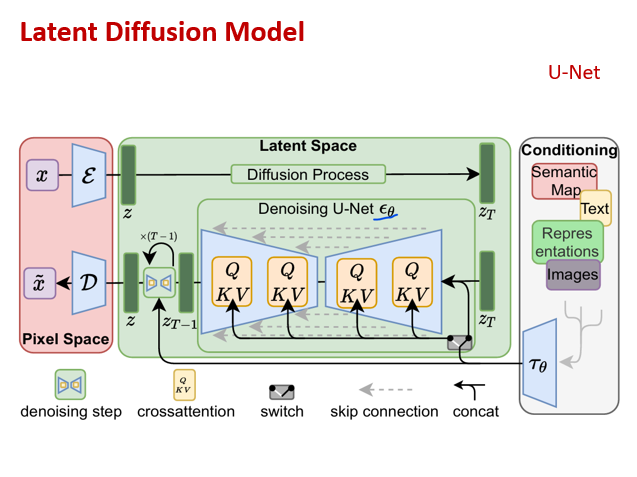

# 🖼️ Text-to-Image Synthesis using Latent Diffusion Models (LDM)

This project implements a **Generative AI pipeline** that synthesizes high-resolution images from text prompts using a **Latent Diffusion Model (LDM)**. The system integrates a pre-trained autoencoder, cross-attention U-Net, and CLIP-based text encoder to generate visually realistic images conditioned on natural language inputs. This project has code to train your LDM model from scratch on MS-COCO or Flickr-30k dataset, you just need 24 GB GPU for training purpose.

## 🧠 What is LDM?

Latent Diffusion Models operate in the **latent space** (instead of pixel space), making them significantly more memory-efficient while retaining strong generation quality. By compressing images before diffusion, LDMs reduce training costs and generate faster without compromising visual fidelity.

  

## 🚀 Features

- 📝 Text-to-image synthesis with prompt conditioning
- 🧩 Modular architecture: Autoencoder, U-Net, and CLIP
- 🧠 Trained on the **MS-COCO** dataset
- 📊 Realistic generations with **FID scores between 90–120**
- ⚙️ Based on open-source HuggingFace and PyTorch frameworks

## 🛠 Tech Stack

- **Language:** Python
- **Frameworks:** PyTorch, HuggingFace Transformers, Diffusers
- **Other Tools:** NumPy, Matplotlib
- **Dataset:** [MS-COCO](https://cocodataset.org)

## 📁 ScreenShot

  

  

